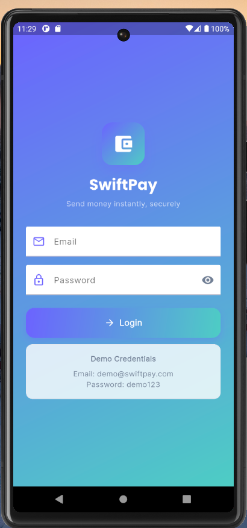
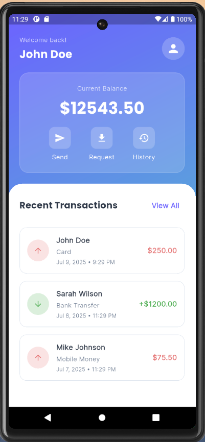
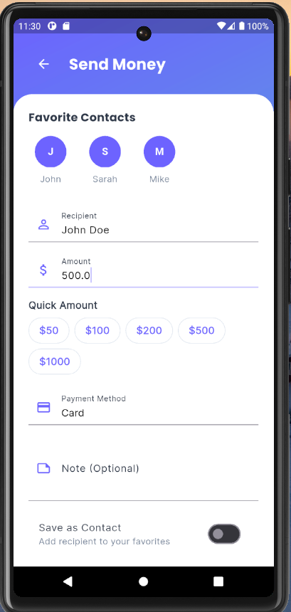

# 💰 SwiftPay - Money Transfer App

A modern, secure, and user-friendly Flutter money transfer application with interactive widgets, custom animations, and a beautiful UI design.

## 📱 Screenshots

<div align="center">
  
  
  
</div>

## ✨ Features

### 🔐 **Authentication**
- **Secure Login System** with email and password validation
- **Modern UI** with gradient backgrounds and smooth animations
- **Demo Credentials** for easy testing:
  - Email: `demo@swiftpay.com`
  - Password: `password123`

### 🏠 **Dashboard**
- **Real-time Balance Display** with animated counter
- **Transaction History** with detailed records
- **Quick Actions** for common operations
- **Recent Transactions** overview
- **Responsive Design** for all screen sizes

### 💸 **Send Money**
- **Interactive Form** with comprehensive validation
- **Favorite Contacts** for quick recipient selection
- **Payment Methods** with dropdown selection (Card, Bank Transfer, Mobile Money, Crypto)
- **Quick Amount Selection** with preset values
- **Transaction Notes** for record keeping
- **Real-time Validation** with user-friendly error messages

### 🎨 **UI/UX Excellence**
- **Material Design 3** with custom theming
- **Smooth Animations** and transitions
- **Responsive Layout** for mobile, tablet, and desktop
- **High Contrast Text** for accessibility
- **Professional Color Scheme** with gradient backgrounds

## 🚀 Getting Started

### Prerequisites
- Flutter SDK (>=3.0.0)
- Dart SDK (>=3.0.0)
- Android Studio / VS Code
- Git

### Installation

1. **Clone the repository**
   ```bash
   git clone https://github.com/PLP-Dart-Projects/money_transfer_app.git
   cd /money_transfer_app
   ```

2. **Install dependencies**
   ```bash
   flutter pub get
   ```

3. **Run the app**
   ```bash
   flutter run
   ```

### Platform Support
- ✅ **Android** (API 21+)
- ✅ **iOS** (iOS 11+)
- ✅ **Web** (Chrome, Firefox, Safari)
- ✅ **Desktop** (Windows, macOS, Linux)

## 🔧 Dependencies

| Package | Version | Purpose |
|---------|---------|---------|
| `flutter` | SDK | Core framework |
| `cupertino_icons` | ^1.0.2 | iOS-style icons |
| `flutter_animate` | ^4.3.0 | Smooth animations |
| `google_fonts` | ^6.1.0 | Typography |
| `intl` | ^0.18.1 | Internationalization |

## 🎯 Key Requirements Implemented

### Part 1: Interactive Widgets ✅
- **TextField** for recipient name and amount input
- **DropdownButton** for payment method selection
- **Switch** for favorite transaction marking
- **Comprehensive Form Validation**:
  - Recipient name cannot be empty
  - Amount must be positive number
  - Visual feedback for validation errors

### Part 2: Custom Widgets ✅
- **Custom Reusable Button** (`CustomSendButton`)
- **Consistent UI Styling** across all components
- **Modular Widget Architecture** for maintainability

### Part 3: Animations ✅
- **Smooth UI Transitions** with AnimatedContainer
- **Success Message Animations** with AnimatedOpacity
- **Custom Page Transitions** between screens
- **Interactive Element Animations** for better UX

## 🎨 Design System

### Color Palette
- **Primary**: Deep Blue (#1E3A8A)
- **Secondary**: Teal (#0D9488)
- **Accent**: Purple (#7C3AED)
- **Background**: Gradient (Primary → Secondary)
- **Text**: High contrast for accessibility

### Typography
- **Heading**: Bold, 24px
- **Subheading**: Medium, 18px
- **Body**: Regular, 16px
- **Caption**: Light, 14px

## 📱 Responsive Design

The app adapts to different screen sizes:
- **Mobile**: Optimized for phones (320px - 768px)
- **Tablet**: Enhanced layout for tablets (768px - 1024px)
- **Desktop**: Full-featured desktop experience (1024px+)

## 🔒 Security Features

- **Input Validation** for all form fields
- **Secure Authentication** simulation
- **Transaction Limits** to prevent large transfers
- **Data Sanitization** for user inputs

## 🧪 Testing

### Demo Credentials
- **Email**: `demo@swiftpay.com`
- **Password**: `password123`

### Test Scenarios
1. **Login Flow**: Test with valid/invalid credentials
2. **Dashboard Navigation**: Verify all buttons and transitions
3. **Send Money**: Test form validation and submission
4. **Responsive Design**: Test on different screen sizes

## 🚀 Build & Deploy

### Android
```bash
flutter build apk --release
```

### iOS
```bash
flutter build ios --release
```

### Web
```bash
flutter build web --release
```

### Desktop
```bash
flutter build windows --release
flutter build macos --release
flutter build linux --release
```

## 🐛 Troubleshooting

### Common Issues

1. **Flutter Version Compatibility**
   - Ensure Flutter SDK >=3.0.0
   - Run `flutter doctor` to check setup

2. **Dependency Issues**
   - Run `flutter clean && flutter pub get`
   - Update dependencies if needed

3. **Build Errors**
   - Check Android SDK configuration
   - Verify Xcode setup for iOS builds

## 📈 Performance Optimization

- **Lazy Loading** for transaction history
- **Efficient State Management** with StatefulWidget
- **Optimized Images** and assets
- **Minimal Rebuilds** with proper widget structure

## 🔮 Future Enhancements

- [ ] **Real Backend Integration** with APIs
- [ ] **Biometric Authentication** (fingerprint/face recognition)
- [ ] **Push Notifications** for transaction updates
- [ ] **Multi-language Support** with internationalization
- [ ] **Dark/Light Theme** toggle
- [ ] **Transaction Categories** and analytics
- [ ] **Currency Conversion** for international transfers

## 👥 Contributing

1. Fork the repository
2. Create your feature branch (`git checkout -b feature/amazing-feature`)
3. Commit your changes (`git commit -m 'Add some amazing feature'`)
4. Push to the branch (`git push origin feature/amazing-feature`)
5. Open a Pull Request

## 📝 License

This project is created for educational purposes as part of the PLP Dart Projects curriculum.

## 🤝 Support

For support and questions:
- Create an issue in the repository
- Contact the development team
- Check the documentation
